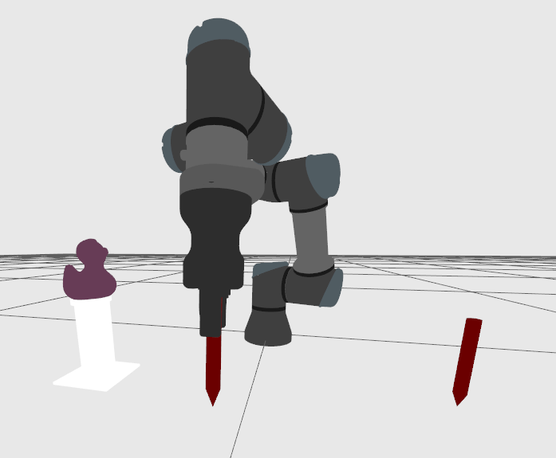
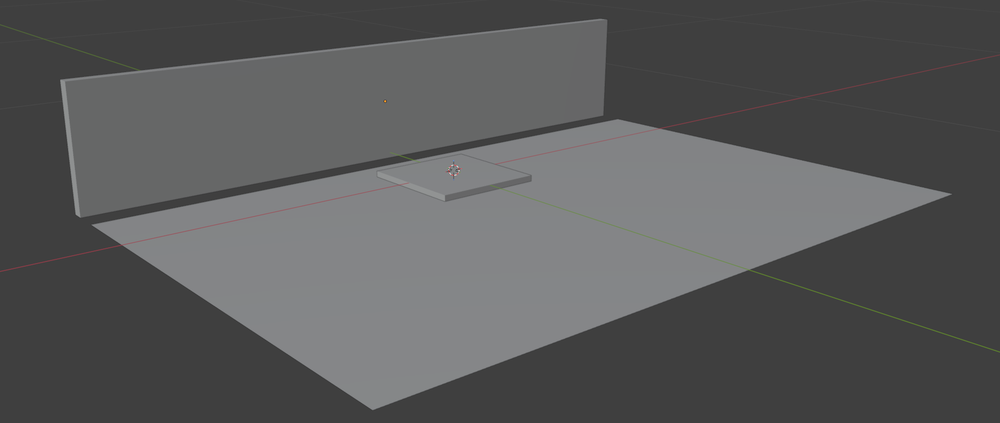
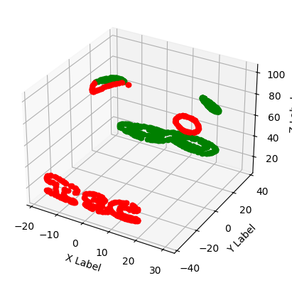

# Duckify - Overview

This file is an overview of all my work for the Duckify project.

## 1. Reflexion technique sur les stylo

J'ai réflchis à comment le bras robot allait tenir le stylo pour être plus efficace. La conclusion de la tenir comme sur le sketch est car ca évite que le stylo puisse glicer de côté.

- [pen-grip](../assets/semaine1/pen-grip.png)
- [pen-grip](../assets/semaine1/pen-grip-bad.png)

Ensuite la reflexion de comment le robot allait prendre ces stylos pour pouvoir dessiner. Des support à stylos qui tiennent les stylo verticalemet avec la pointe du stylo dans le support, permettant au bras de les prendre depuis le haut.

- [pen support](../assets/semaine1/pen-support.png)

## 2. La zone atteignable du bras

Pour que le robot puisse dessiner sur l'entièreté du canard, il fallait savoir jusqu'à où le bras pouvait aller.

Pour cela, il fallait prendre en compte le stylo tenu, la longeur du bras et de ses joints, les collisions, la positions du canard (et la hauteur), etc. Beaucoup plus de chose à prendre en compte que j'avais prévu. Je me suis alors dis que ce travail demandait trop de temps comparé à ce qu'il accomplissait.

<!-- 
## 3. Environnement de Simulation

Pour améliorer l'environnement de simulation, j'ai du analyser des nouveaux formats de fichier comme `.urdf`, `.sdf` pour pouvoir intégrer nos propres modèles. La simulation contenait le canard, son suport et les stylos, comme dans l'image:

Malheureusement, nous n'avions que accès à l'image Docker du simulateur Gazebo, avec lequel nous aurions pu modifier les configuration et les persister dans chaque nouveau container. J'ai alors créé un guide de setup pour aider les autres: [sim_setup](https://github.com/Toys-R-Us-Rex/ur3e-simulator/blob/main/simulation_setup.md) -->

<!-- ## 4. Simulation et Contrôle

Pour ce projet, on a dû utiliser un environnement de simulation pour pouvoir expérimenter avec les mouvements du bras robot avant de pouvoir utiliser le vrai. Cette tâche demander de la recherche du nouveau code à utiliser pour pouvoir ce lancer dans le projet. J'ai pu lancer une démo de movements du bras pour le confirmer.

 -->

<!-- ## 5. Workspace de Travail

Pour éviter les collisions avec le sol et d'autres objects physique autour du bras robot, j'ai fait un simple modèle 3D qui représent le bureau de travail du bras robot. Pour faire cela j'ai pris des mesures au milimètres près pour assurer la précision du modèle.

 -->

<!-- ## 6. Filtrer les traces

Nous avons remarqué que pas tout les points du canard était accéssible. Pour pouvoir s'assurer qu'on puisse dessiner sur le canard, une autre solution a été réfléchi. Couper le canard en deux et le dessiner chaque côté séparément comme sur l'image ici:

  * [`filter.py`](http://github.com/Toys-R-Us-Rex/ur3e-control/blob/dev/clean-merge-pipeline/src/filter.py)
  * [`segment.py`](https://github.com/Toys-R-Us-Rex/ur3e-control/blob/dev/clean-merge-pipeline/src/segment.py) -->

<!-- 
## 8. Integration Simulateur

Jusqu'à présent, le simulateur était une image docker chargée via un fichier zip, mais ce n'était pas très pratique à partager avec d'autres collègues. La solution que j'ai pensée était d'utiliser un référentiel de containers. J'ai vu que nous pouvions télécharger l'image docker sur le GHCR. Une fois téléchargée, les personnes de l'organisation github avaient seulement besoin d'exécuter un docker pull pour obtenir l'image : [iscoin-simulator]("https://github.com/orgs/Toys-R-Us-Rex/packages/container/package/iscoin-simulator").

J'ai ajouté un guide sur comment intégrer tout cela dans le fichier [robot README.md]("https://github.com/Toys-R-Us-Rex/Duckify/blob/main/robot/README.md"). -->

<!-- 
## 9. Partage de connaissances

Pour partager ce que j'ai fait, j'ai souvent écrit de la documentation pour faciliter la tâche pour mes collègues.

- [Simulation Setup](https://github.com/Toys-R-Us-Rex/ur3e-simulator/blob/main/simulation_setup.md)
- [Robot README.md](https://github.com/Toys-R-Us-Rex/Duckify/blob/main/robot/README.md) -->

<!-- ## 10. Transitions de stylo

Après avoir effectué des tests de transitions de stylo avec le robot physique, il fallait que ce code soit facilement intégrable dans la partie dessin. Pour cela j'ai transformé le code de test en classe. Cette classe peut être utilisé très simplement.

[`pen.py`](https://github.com/Toys-R-Us-Rex/Duckify/blob/main/robot/src/pen.py) -->

## What is Missing ?

- Add faced problems
- Explain reasoning behind filter class (reachability)
- Analyse de .urdf .sdf pour la simulation
- Mieux démontrer les compétences avec les artéfacts
- Préciser l'analyse humain dans la partir robot tech analysis